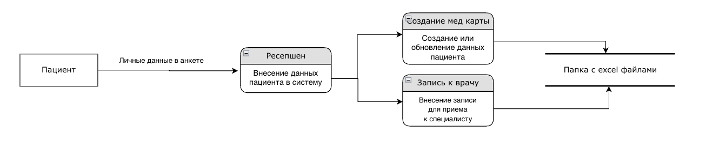
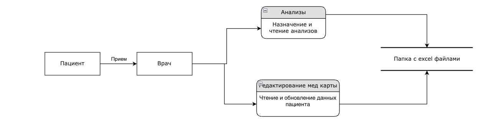
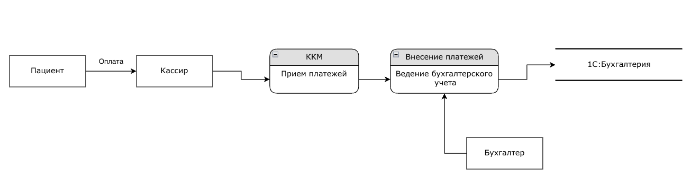
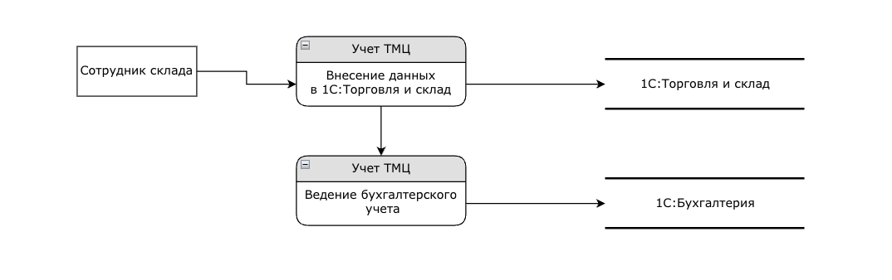

 # Текущее состояние системы

## Конфиденциальные данные

- Ф. И. О.дату рождения, телефон и электронную почту. Ещё он может заполнить расширенную форму, которая включает вопросы об адресе прописки, месте работы или учёбы, хронических заболевания 

- ФИО
- дата рождения
- телефон
- электронная почта
- адрес
- место работы и учебы
- хронические заболевания
- анализы

## Диаграммы DFD

Запись к специалисту

Прием у врача

Оплата

Учет ТМЦ

## Проблемные данные

 - не используется шифрование данных на время хранения
 - не контролируется доступ к информации в зависимости от роли пользователя.
 - Кроме доменной аутентификации, со стороны систем обработки нет ограничений на доступ к данным,  есть опасность несанкционированного доступа
 - нет резервных копий данных
 - нет учета действий пользователей

## Что можно улучшить

- Настроить авторизацию для доступа к данным
- Настроить доступ к разным директориям на основе ролей.
- Делать резервное копирование данных в определенный интервал времени
- настроить шифрование файлов на диске

Можно также разделить данные по уровню доступа (классификация данных).

Использовать систему хранения данных с возможностью аудита действий.