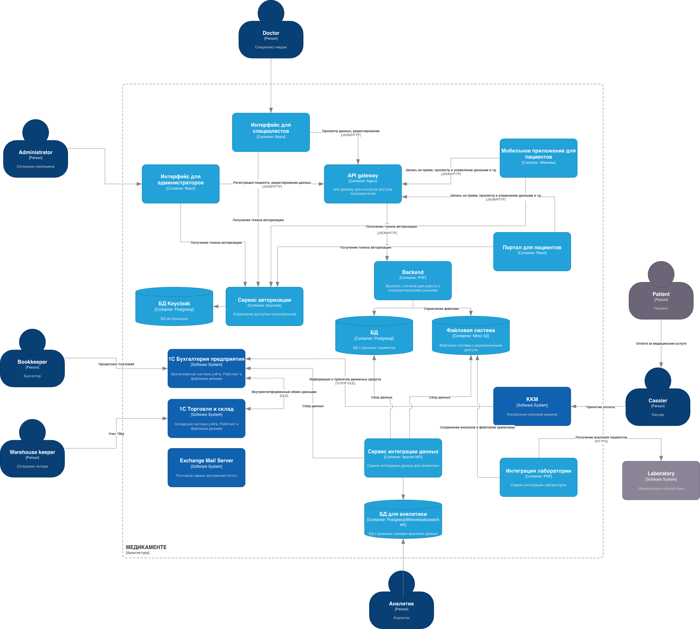

# Проектирование решения

Применяется разграничение доступа с помощью авторизации Keycloak.

Backend системы придставлен в виде монолитного приложения. Это сделано умышленно, т.к. при штате всего в несколько десятков человек, будет сложно поддерживать микросервисное решение. 

Тем не менее, созданы предпосылки к возможному переходу на микросервисное решение при необходимости в виде API-gateway. 

Сбор данных осуществляется с помощью Apache NiFi.

Диаграмма С4
