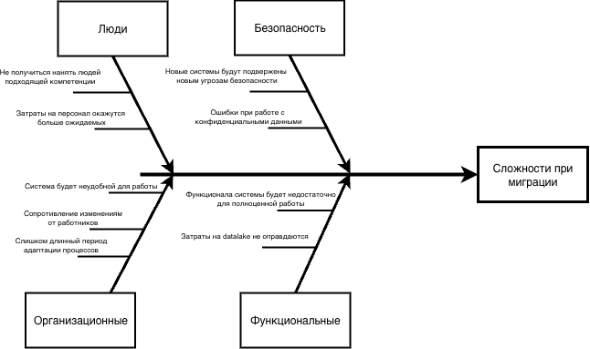

# Диаграмма Исикавы

## Проблемы при миграции

1. Люди:

+ Не получиться нанять людей подходящей компетенции
+ Затраты на персонал окажутся больше ожидаемых

Решение: удостовериться в компетенциях HR персонала для найма it специалистов. План перехода на миграции должен включать перечень специалистов, необходимых для реализации системы.

2. Организационные

+ Система будет неудобной для работы 
+ Сопротивление изменениям от работников
+ Слишком длинный период адаптации процессов

Решение: качественно собрать коллективные знания, быть в курсе всех процессов в компании, чтобы не упустить важные детали. 

После введения системы в работу разработать регламенты, провести презентации для ознакомления с функциональностью системы. Собрать обратную связь и доработать при необходимости.

3. Безопасность

+ Новые системы будут подвержены новым угрозам безопасности
+ Ошибки при работе с конфиденциальными данными

Решение: специалист по безопасности должен комплексно проверить систему. Разработать регламент действий для внештатных ситуаций. Регулярно проводить аудит системы и действий сотрудников.

4. Функциональные

+ Функционала системы будет недостаточно для полноценной работы
+ Затраты на datalake не оправдаются 

Решение: качественное планирование изменений. Собрать все причины для реализации datalake и оценить его необходимость. 

### Приоритет

При реализации системы ставить на первое место пукты, связанные с безопасностью. Так следует уделить особое внимание планированию системы и плана перехода.